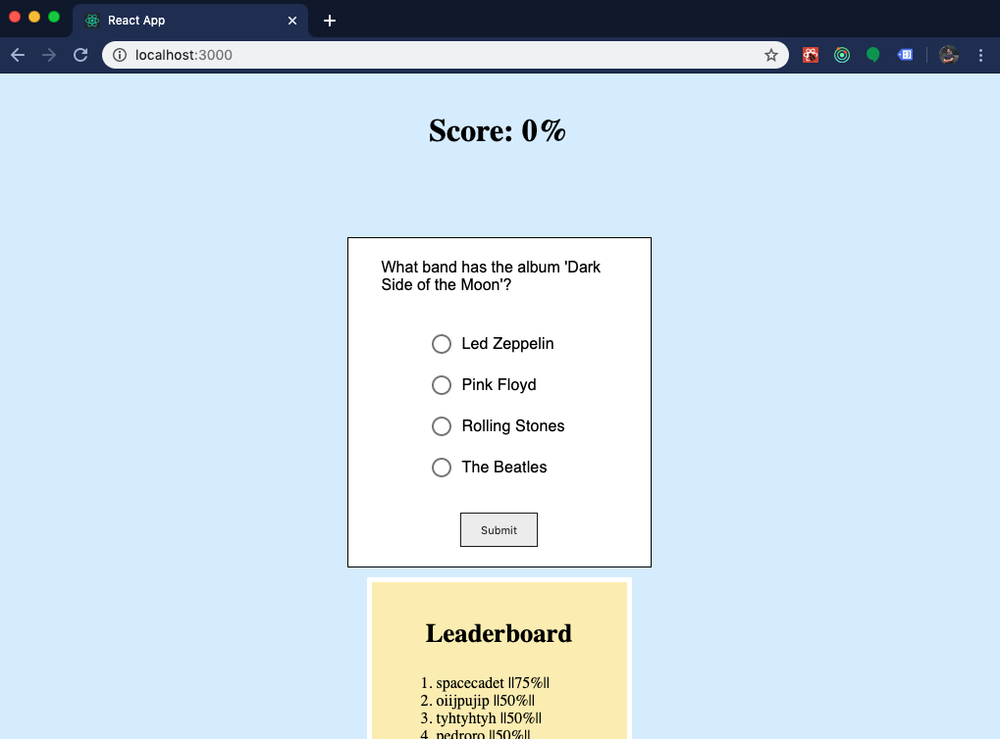

## Rock Music Quiz

A short quiz/game about rock music made using:

- React (Hooks)
- Redux
- Node
- Express
- MongoDB

The reason for needing a database is so that the game can have a cool little leaderboard!

Check it out on heroku: https://evening-depths-59518.herokuapp.com/

If you're interested in cloning it, run these commands to ge it up and running on your machine:

1. npm i
2. cd client
3. npm i
4. cd ..
5. npm run dev

You will probably get an error about missing a MongoDB URI string but that shouldn't effect your ability to run the project and play around with the code.

Enjoy ☘️
